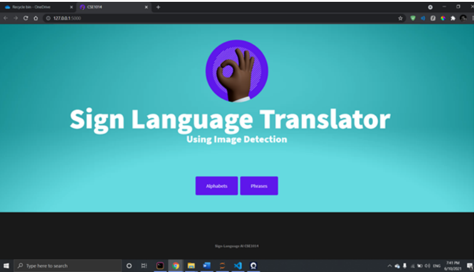

# AI Sign Language Translation
SSD is a single shot detector- meaning it only needs one shot at the
image to analyze and calculate predictions. What it does is discretizes
the output space of bounding boxes into a set of default boxes over
different aspect ratios and scales per feature map location which in or
project's case is MobileNet. These bounding boxes are laid over some
ground truth which we have already initialized using labelImg. During
prediction time, the network generates scores for the presence of each
object category in each default box and produces adjustments to the
box to better match the object shape

Now, for implementing our training models, we have used jupyter notebook
and the TensorFlow library. Now, that we’ve established the importance of
SSD’s speed and accuracy, we then move on to add it into our project step
by step. Since our project deals with sign-language translation for alphabets
and phrases – we split our working directories into two.
Our python code consists of basic code to train two of our models, SSD
320X320 and SSD 640x640. As mentioned before these two models will
ensure different accuracies by processing the image in different resolutions.
In both of our directories we create labels for our alphabets as well as
phrases as shown below:

Once we are done with labels, we move into creating “.ptxt” file that stores
all of these. This file will be used to access the labels later on.
Before going to the next step, we make sure that all our training and testing
images have been properly labelled:

Once we are done labelling our images, we then use the
“generatetfrecord.py” file to create TensorFlow records for both our training
and testing images. This file ensure that the images our attached into a file
with their respective labels and thus is useful when we provide it during our
fine-tuning of the pre-trained model.
We, then download and extract our models and finetune it to have the
same number of classes as our label class and modify all the paths to
TFrecords and the “.pbtxt” file as well as modifying our batch sizes. Once
fine-tuning is done, we use python code to run the mainmodel.py to train
our models for about 5000 steps.

## Images

